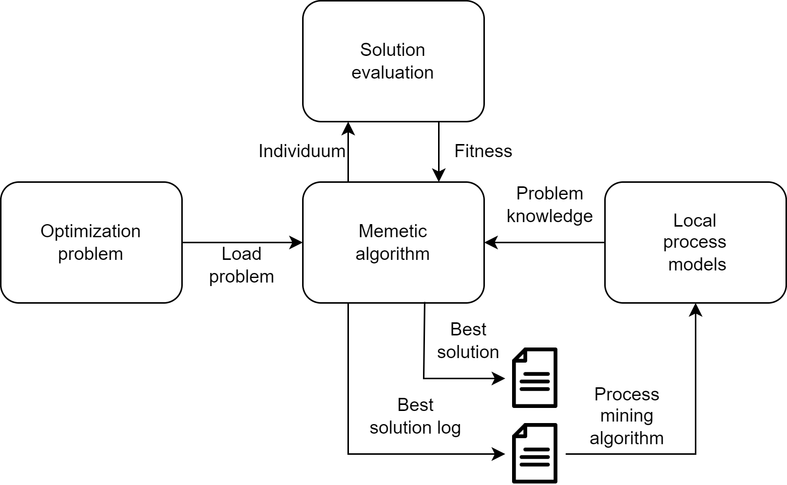

# Process mining based memetic algorithm
## Problem overview
In the following picture an overview of the memetic algorithm with local process models is given:

<ol>
  <li>A optimization problem is loaded</li>
  <li>The memetic algorithm starts by creating a population of individual solutions</li>
  <li>All solutions are evaluated and fitness is assigned to each individual</li>
  <li>When a new best solution is found, a log of this solution is created and local process models are mined</li>
  <li>This local process models represent problem specific knowledge</li>
  <li>From now on, whenever a good solution is found a variable neighborhood search that utilizes the local process models is applied</li>
</ol>
